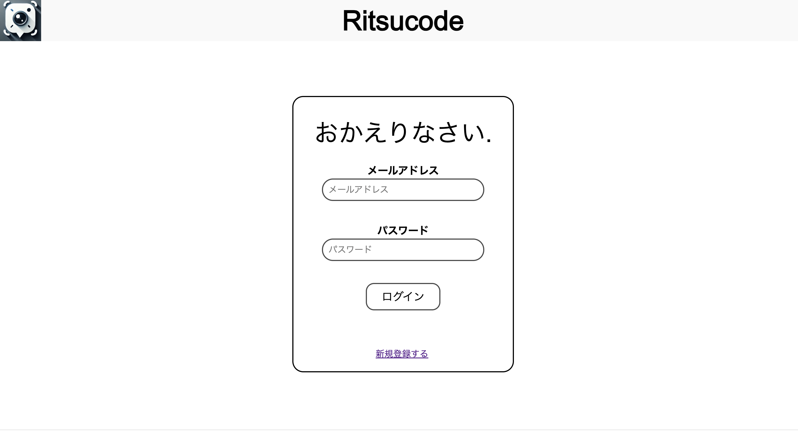
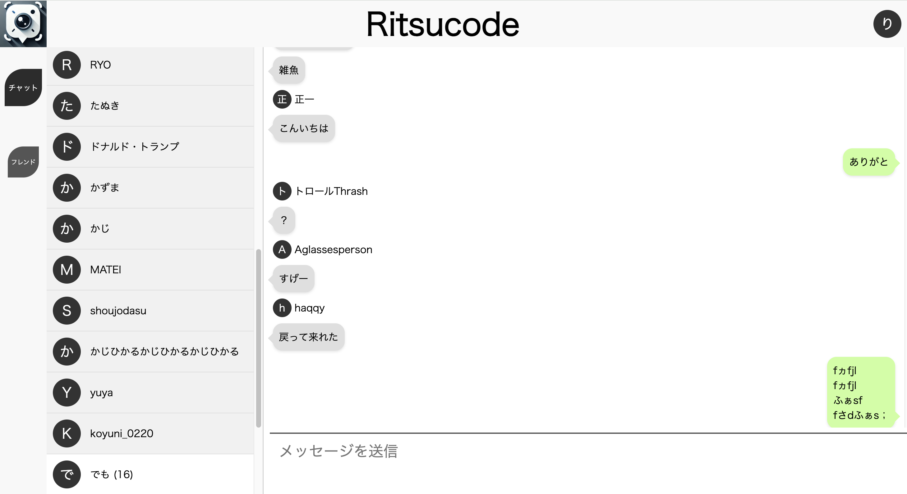

# [Ritsucode](https://rikyhome.net)

 

---

## プロジェクト概要

**Ritsucode** は、Web 上で **個人チャット** と **グループチャット** ができるリアルタイムコミュニケーションアプリです。  
メール認証＋JWT トークンによる 2 段階認証、フレンド申請機能、グループ作成機能を備えています。  
データベースと WebSocket により、リアルタイムに会話が進行し、その会話を記録します。

---

## 参考画像

  

---

## 主な機能

- **ユーザー登録 / ログイン**  
  - メールアドレス登録時にワンタイム認証コードを送信  
  - 認証成功後に本ログイン画面へ（2 段階認証対応）  
- **JWT トークン管理**  
  - ログイン後の自動再認証／セッション維持  
  - HTTPS＋JWT で安全にデータ送受信  
- **フレンド管理**  
  - ユーザー名検索からフレンド申請  
  - 承認 or 拒否のリアルタイムリクエスト  
- **リアルタイムチャット**  
  - 1:1（プライベート）チャット  
  - 複数人（グループ）チャット  
  - WebSocket＋SQLite で高速なメッセージ同期  
---

## 使用技術

- **フロントエンド**  
  - HTML5 / CSS3 / JavaScript (ES2021)  
- **バックエンド**  
  - **Web サーバー**：nginx  
  - **Socket サーバー**：Node.js
  - **データベース**：SQLite 3  
- **認証**  
  - メール送信：PHPmailer  
  - JWT：`jsonwebtoken`  

